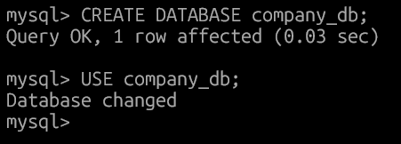
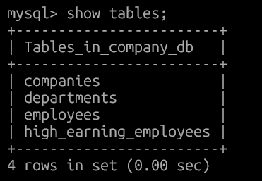
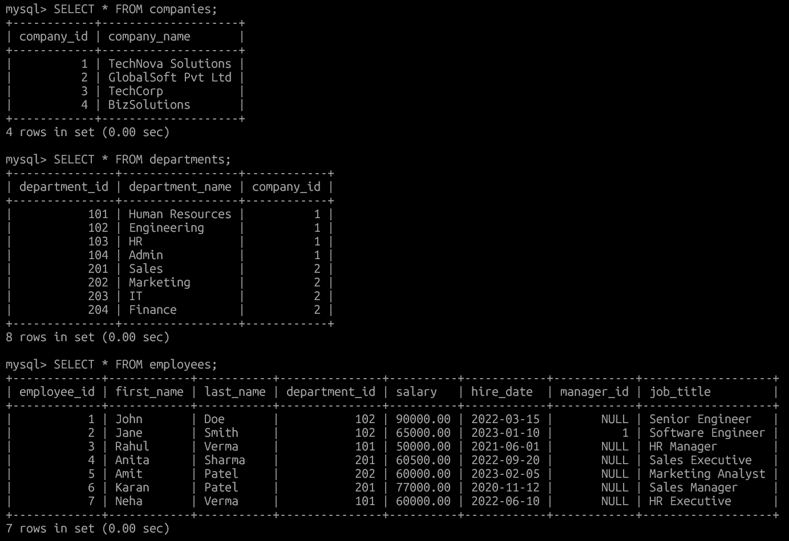
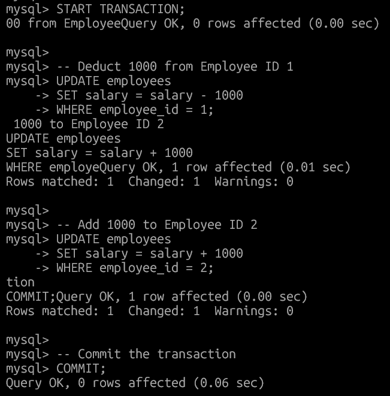
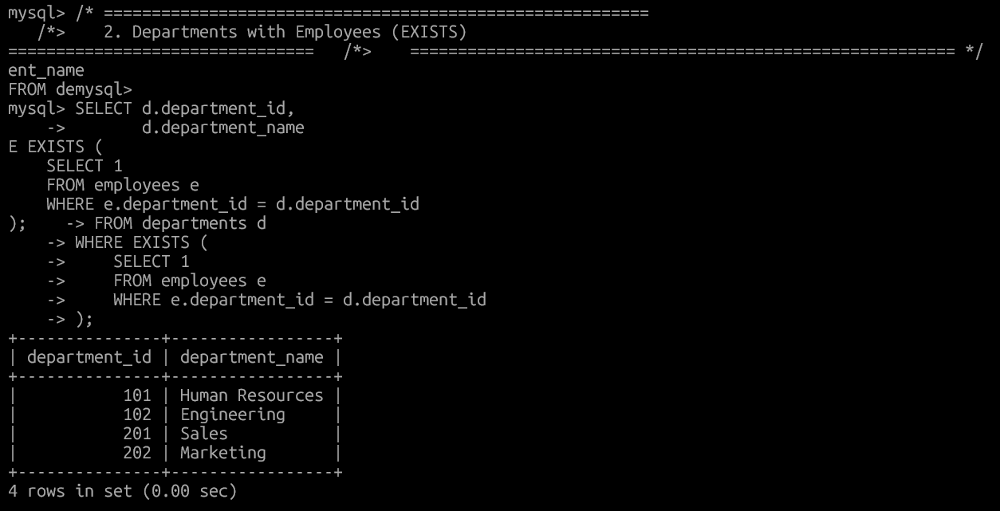
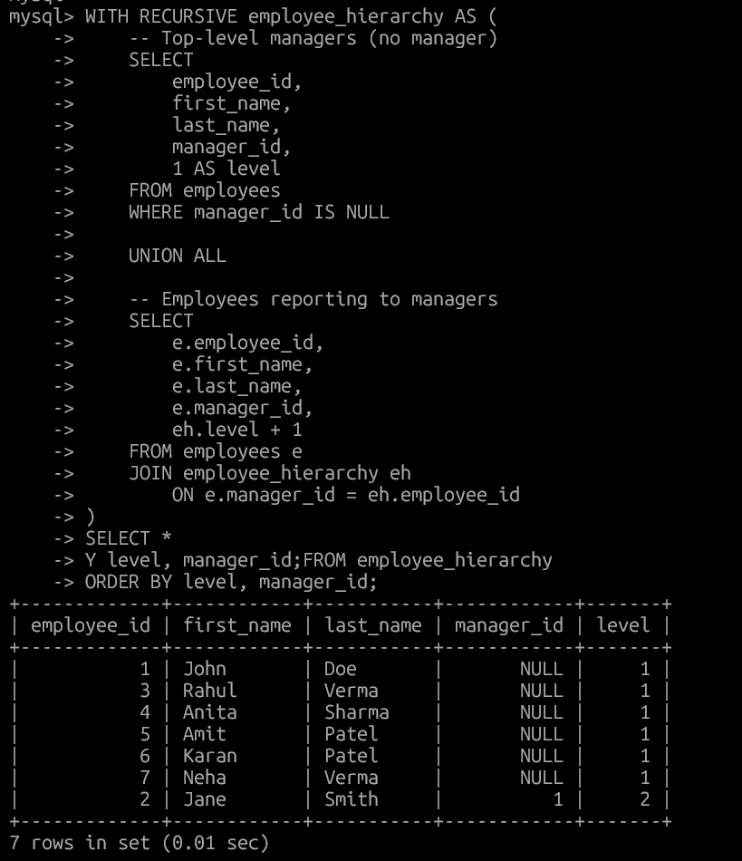
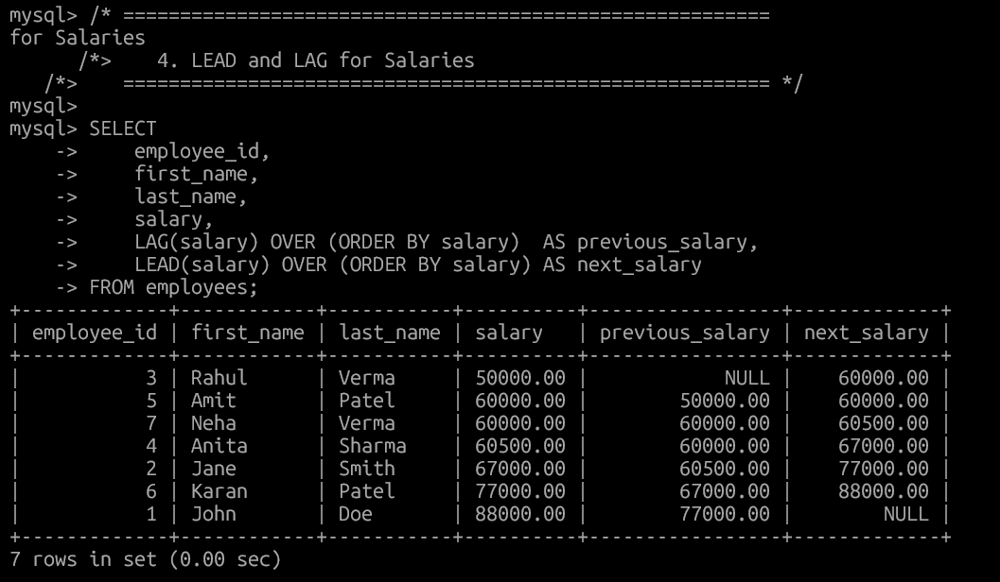
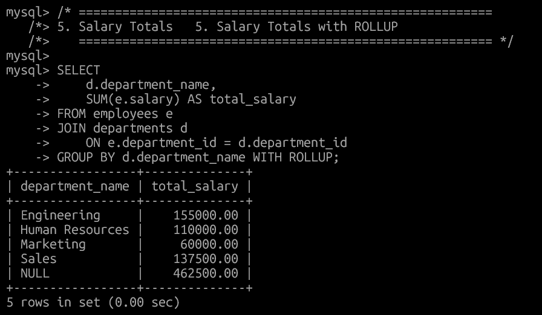
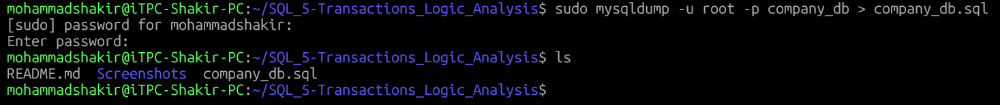

#  Transactions, Logic & Analysis
---

##  Project Overview

This assignment focuses on implementing SQL transactions, conditional logic, recursive CTEs, and analytical functions. It provides hands-on experience with salary processing, data aggregation, and database export techniques. It also includes database export using `mysqldump`.

---
## Folder Structure
```md
SQL_5-Transactions_Logic_Analysis/
├── README.md
├── Screenshots
│   ├── 01-create-database.png
│   ├── 02-create-tables.png
│   ├── 03-insert-data.png
│   ├── 04-transaction-salary-transfer.png
│   ├── 05-departments-exists.png
│   ├── 06-recursive-cte-hierarchy.png
│   ├── 07-lead-lag-salary.png
│   ├── 08-salary-rollup.png
│   └── 09-mysqldump.png
└── company_db.sql
```

##  Database Structure & Data Setup

### 1) Database Creation


### 2) Tables Creation
- Companies Table  
- Departments Table  
- Employees Table  



### 3) Data Insertion


---

##  Task 1: Transaction – Salary Transfer

**Description:**  
Transfers 1000 salary from one employee to another using a transaction to ensure data integrity.



---

##  Task 2: Departments with Employees (EXISTS)

**Description:**  
Uses the `EXISTS` clause to find departments that have at least one employee.



---

##  Task 3: Recursive CTE – Employee Manager Hierarchy

**Description:**  
Displays employee–manager hierarchy using a recursive Common Table Expression (CTE).



---

##  Task 4: LEAD & LAG – Salary Analysis

**Description:**  
Shows previous and next salaries for each employee using analytical functions.



---

##  Task 5: Salary Totals with ROLLUP

**Description:**  
Displays department-wise salary totals and overall salary using `GROUP BY ROLLUP`.



---

##  Task 6: Database Export

**Description:**  
Database structure and data exported using `mysqldump`.

```bash
mysqldump -u root -p your_database_name > your_database_name_backup.sql


###### Conclusion

This assignment covers core SQL concepts including transactions, conditional logic, recursion, analytical functions, and aggregation. It also demonstrates best practices for database backup and documentation.
